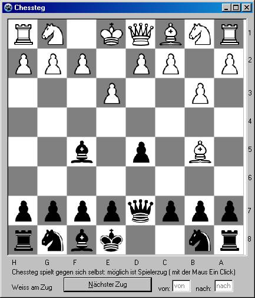

# chess
chess game

In my spare time I like to write chess programs. Chessteg is one of my first chess programs and arose from a rook endgame generator with a move generator, alpha-beta pruning and evaluation function. The source code is particularly simple and suitable for beginners.

